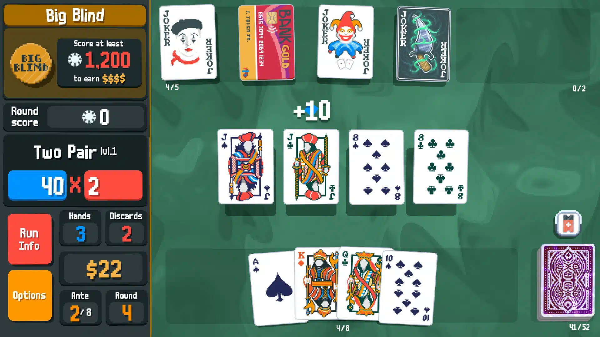

# GAMESEED 2025 Game Design Document
Theme: Old but new

## Game Identity
Video game based on the Purble Pairs minigame from [Purble Place](https://en.wikipedia.org/wiki/Purble_Place) where you fight enemies by matching [card pairs](https://en.wikipedia.org/wiki/Concentration_(card_game)).

## Design Pillars
Nostalgic. Simple. Memorization.

## Genre/Story/Mechanics Summary
Purble Pairs is a pattern recognition/memory game that could be classified as a puzzle game. The idea is to use the main mechanic from Purble Pairs and turn it into the battle mechanics for this game.

The player will initiate battles similar in style to Slay the Spire, but they attack enemies by matching card pairs. For example, if the player manages to match two *Fireball* cards, their character will cast a fireball, damaging the enemy.

## Features
### Cards
Cards are the thing you need to match. In general, you need to match the same 2 cards in a row to activate its effect. However, there are special cards that need 3 of the same card to activate their effects.

#### List of Cards
- Sword: Attacks for 1 DMG
- Fireball: Attacks for 2 DMG
- Shield: Blocks 1 DMG from the enemy
- Heal (special): Heals the player for 2 HP

### Enemies
Enemies are the thing you need to fight. They have HP and attack in a set interval. You proceed to the next stage by killing enemies.

#### List of Enemies
- Slime: 5 HP, 1 DMG/3 s

## Interface
Click on a card to turn it face up. If you click on another card and it is not the same type of card, both cards will be turned face down. If you do find the same type of card, its effect will be activated and the cards will be discarded.

### Grid
The grid is the area where you play the cards. The grid starts at 5x5.

### Combat Window
The combat window is the area where the "visualization" of the battle happens. You can see the player, the enemy, and their attacks.

### Player Stats
The player stat is where you can see the player's HP and other important stats.

## Art Style
The combat window is inspired by Slay the Spire's combat screen.

Meanwhile, the grid or card matching area is inspired by Balatro.

## Music/Sound
TBA

## Other Info
- **Platform:** Web (itch.io), desktop (Windows exe file)

- **Submission Date:** 4th of August (please finish it the day before)